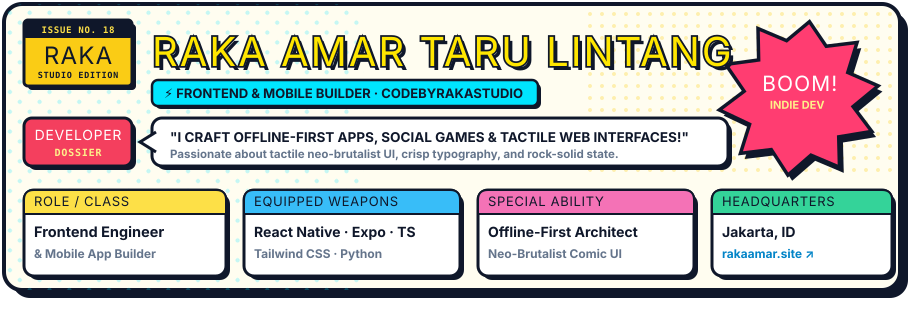

  

 

### 💥 ISSUE #18: THE ORIGIN STORY

> *"Great software feels like a classic comic: bold outlines, zero filler, and every panel serves the story."*

Hey there! I'm **Raka Amar Taru Lintang** ([@RakaAmar18](https://github.com/RakaAmar18) / **CodeByRakaStudio**), a frontend engineer and mobile app builder based in **Jakarta, Indonesia**.

I specialize in building **offline-first party games**, **tactile mobile apps**, and **clean web interfaces**. I care deeply about neo-brutalist & comic aesthetics, physical button feel, responsive multi-breakpoint layouts, and bulletproof client-side state.

---

### ⚡ EQUIPPED SKILLS & ARSENAL

| Category | Powers & Technologies |
| :--- | :--- |
| **📱 Mobile Engineering** | React Native, Expo SDK, Android Hybrid, React Navigation, Reanimated, Fisher-Yates Game Logic |
| **🎨 UI & Design Systems** | Neo-Brutalist & Comic UI, Tactile Drop Shadows, Responsive Layout Engine, Vector Graphics (SVG), Figma |
| **🌐 Modern Frontend** | TypeScript, JavaScript (ESNext), React, Tailwind CSS, HTML5 / CSS3, Service Workers |
| **⚙️ Edge & Backend** | Cloudflare Workers, Node.js, REST APIs, MySQL, SQLite |
| **🛠️ Dev Tools & Workflow** | Git & GitHub, Android Studio, Gradle, npm, GitHub Actions CI, Python |

---

### 🎮 FEATURED QUESTS & RELEASES

<table>
  <tr>
    <td width="50%" valign="top">
      <h4>🕵️‍♂️ Siasat Kata: Pesta Penyusup</h4>
      
<b>Offline-First Social Deduction Party Word Game for Android.</b>

      
Pass a single device around the room, receive secret role cards without peeking, interrogate your friends, and vote out the impostor! Built with pure offline rotation, custom comic design tokens, bilingual gameplay (ID/EN), and native 9:16 story cards.

      
<b>Arsenal:</b> React Native · Expo SDK 54 · TypeScript · Reanimated · Android

    </td>
    <td width="50%" valign="top">
      <h4>🌐 <a href="https://rakaamar.site/">Personal Portfolio &amp; HQ</a></h4>
      
<b>Interactive Developer Portfolio &amp; Design Showcase.</b>

      
Personal web headquarters featuring reactive dark/light themes, smooth layout transitions, project highlights, and integrated CV downloads.

      
<b>Arsenal:</b> HTML5 · CSS3 · Modern JavaScript · Responsive Architecture

      
🔗 <a href="https://rakaamar.site/"><b>Explore Live: rakaamar.site ↗</b></a>

    </td>
  </tr>
  <tr>
    <td width="50%" valign="top">
      <h4>🔐 <a href="https://github.com/RakaAmar18/secretcode">StealthText</a></h4>
      
<b>Zero-Leak Client-Side Cryptographic Privacy Web App.</b>

      
Encrypt and decrypt secret messages with instant visual feedback. Completely serverless, running 100% in the user's browser with offline PWA service worker support.

      
<b>Arsenal:</b> Web Cryptography API · PWA Service Worker · Vanilla JavaScript

    </td>
    <td width="50%" valign="top">
      <h4>📑 <a href="https://github.com/RakaAmar18/Pembuatan-Surat-Berharga">Document Service System</a></h4>
      
<b>Desktop Workflow &amp; Logistics Management Hub.</b>

      
Desktop business application for document request workflows. Features role-based access (User/Admin), relational database automation, and distance-based delivery calculations.

      
<b>Arsenal:</b> Python · Tkinter · MySQL · Laragon

    </td>
  </tr>
</table>

---

### 📡 TRANSMISSION CHANNELS (GET IN TOUCH)

Got a cool project idea, an offline game concept, or an interface that needs bold character? Let's talk!

- 🌐 **Web HQ:** [rakaamar.site](https://rakaamar.site/)
- 💻 **GitHub:** [@RakaAmar18](https://github.com/RakaAmar18)
- 📍 **Base:** Jakarta, Indonesia
- ✉️ **Direct Mail:** [mukiyi3747@gmail.com](mailto:mukiyi3747@gmail.com)

 

  Comic-crafted &amp; engineered by Raka Amar Taru Lintang · CodeByRakaStudio

