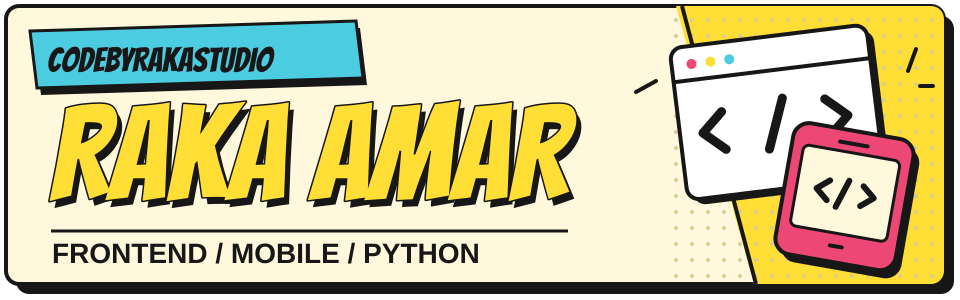

# Halo, saya Raka.

**Raka Amar Taru Lintang · CodeByRakaStudio · Jakarta, Indonesia**

Saya membuat aplikasi mobile, antarmuka web, dan aplikasi desktop dengan Python. Suka tampilan yang berkarakter, alur yang mudah dipahami, dan detail kecil yang membuat produk nyaman dipakai.

**[Lihat portofolio ↗](https://rakaamar.site/)** · **[Hubungi saya](mailto:mukiyi3747@gmail.com)**

## Karya pilihan

### V-Class

**Source private** — ringkasan produk.

Platform pembelajaran digital untuk sekolah: materi, tugas, kuis, dan pengelolaan ujian. Ekosistemnya mencakup aplikasi web serta V-Class ExamHub untuk desktop.

Platform pendidikan · Web & desktop

### Jaga Anabul

**Source private** — ringkasan produk.

Platform donasi dan pengelolaan kampanye untuk shelter serta komunitas penyelamat hewan, yang menghubungkan donatur dengan pengelola organisasi.

React · Laravel · PostgreSQL

### Siasat Kata: Pesta Penyusup

**Source private** — yang ditampilkan di sini hanya ringkasan produk.

Game pesta deduksi sosial untuk Android. Satu ponsel dipakai bergiliran untuk menerima kata rahasia, berdiskusi, dan mencari penyusup. Tampilan komik dan dukungan Bahasa Indonesia / English.

React Native · Expo · TypeScript

### [Portfolio](https://rakaamar.site/)
Situs pribadi untuk memperkenalkan diri dan menampilkan proyek, dengan dukungan tema terang dan gelap.

HTML · CSS · JavaScript · [Source publik ↗](https://github.com/RakaAmar18/Portfolio)

### [StealthText](https://github.com/RakaAmar18/secretcode)
Proyek web untuk enkripsi dan dekripsi teks melalui antarmuka sederhana.

JavaScript · HTML · CSS · [Lihat proyek ↗](https://github.com/RakaAmar18/secretcode)

### [Document Service System](https://github.com/RakaAmar18/Pembuatan-Surat-Berharga)
Proyek aplikasi desktop bersama tim untuk mengelola permohonan dokumen, dashboard admin, dan proses pengiriman.

Python · Tkinter · MySQL · [Lihat proyek ↗](https://github.com/RakaAmar18/Pembuatan-Surat-Berharga)

## Alat & teknologi

Teknologi yang saya gunakan atau pelajari dalam proyek. Bukan peringkat kemampuan.

### Bahasa & framework

<table width="100%">
  <tr>
    <td align="center" width="25%">
      
       <b>TypeScript</b>
    </td>
    <td align="center" width="25%">
      
       <b>JavaScript</b>
    </td>
    <td align="center" width="25%">
      
       <b>Python</b>
    </td>
    <td align="center" width="25%">
      
       <b>PHP</b>
    </td>
  </tr>
  <tr>
    <td align="center" width="25%">
      
       <b>C++</b>
    </td>
    <td align="center" width="25%">
      
       <b>HTML5</b>
    </td>
    <td align="center" width="25%">
      
       <b>CSS3</b>
    </td>
    <td align="center" width="25%">
      
       <b>Bash</b>
    </td>
  </tr>
  <tr>
    <td align="center" width="25%">
      
       <b>React Native</b>
    </td>
    <td align="center" width="25%">
      
       <b>React</b>
    </td>
    <td align="center" width="25%">
      
       <b>Next.js</b>
    </td>
    <td align="center" width="25%">
      
       <b>Tailwind CSS</b>
    </td>
  </tr>
  <tr>
    <td align="center" width="25%">
      
       <b>Laravel</b>
    </td>
    <td align="center" width="25%">
      
       <b>Express.js</b>
    </td>
    <td align="center" width="25%">
      
       <b>Vite</b>
    </td>
    <td align="center" width="25%">
      
       <b>Node.js</b>
    </td>
  </tr>
</table>

<strong>Database, platform & alat pengembangan</strong>

 

<table width="100%">
  <tr>
    <td align="center" width="25%">
      
       <b>PostgreSQL</b>
    </td>
    <td align="center" width="25%">
      
       <b>MySQL</b>
    </td>
    <td align="center" width="25%">
      
       <b>SQLite</b>
    </td>
    <td align="center" width="25%">
      
       <b>Cloudflare</b>
    </td>
  </tr>
  <tr>
    <td align="center" width="25%">
      
       <b>Android Studio</b>
    </td>
    <td align="center" width="25%">
      
       <b>Git</b>
    </td>
    <td align="center" width="25%">
      
       <b>GitHub</b>
    </td>
    <td align="center" width="25%">
      
       <b>VS Code</b>
    </td>
  </tr>
  <tr>
    <td align="center" width="25%">
      
       <b>Postman</b>
    </td>
    <td align="center" width="25%">
      
       <b>Linux</b>
    </td>
    <td align="center" width="25%">
      
       <b>Figma</b>
    </td>
    <td align="center" width="25%">
      
       <b>Gradle</b>
    </td>
  </tr>
  <tr>
    <td align="center" width="25%">
      
       <b>npm</b>
    </td>
    <td align="center" width="25%">
      
       <b>Actions</b>
    </td>
    <td align="center" width="25%">
      
       <b>Vercel</b>
    </td>
    <td align="center" width="25%">
      
       <b>Bootstrap</b>
    </td>
  </tr>
</table>

## Catatan GitHub

  
<strong>Profil & kontribusi</strong>

   
  

    
  

   

  
<strong>Streak kontribusi</strong>

   
  

    
  

   

  
<strong>Bahasa di repository publik</strong>

   
  

    
  

   

  
<strong>Penghitung tampilan profil</strong>

   
  

    
  

   

  
<strong>Kartu repository publik</strong>

   
  

    
    &nbsp;&nbsp;
    
  

   

Kartu statistik memakai layanan eksternal. Bahasa repository publik dan penghitung tampilan bukan ukuran kemampuan atau jumlah pengunjung unik.

---

**Ada ide yang ingin dibuat?** [Mari mengobrol](mailto:mukiyi3747@gmail.com).

[Website](https://rakaamar.site/) · [GitHub](https://github.com/RakaAmar18)
