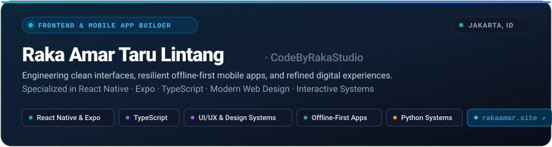

  <picture>
    <source media="(prefers-color-scheme: dark)" srcset="assets/header-dark.svg">
    <source media="(prefers-color-scheme: light)" srcset="assets/header-light.svg">
    
  </picture>

 

### 👋 About Me

I'm **Raka Amar Taru Lintang** ([@RakaAmar18](https://github.com/RakaAmar18) / **CodeByRakaStudio**), a frontend developer and mobile app builder based in Jakarta, Indonesia.

I focus on crafting polished user interfaces, resilient offline-first mobile applications, and interactive digital products. I care deeply about typography, tactile component design, responsive multi-breakpoint layouts, and clean codebase architecture.

---

### 🚀 What I Do

- 📱 **Mobile & Offline-First Engineering** — Building cross-platform apps with React Native & Expo. Designing resilient local state, Fisher-Yates shuffle mechanics, custom device passing flows, and graceful offline degradation.
- 🎨 **Interface & Design Systems** — Creating distinctive neo-brutalist and comic-inspired UI layouts with bold outlines, block drop-shadows, responsive scaling engines, and accessible contrast.
- ⚡ **Modern Frontend Web** — Developing fast, accessible web applications with TypeScript, React, Tailwind CSS, service workers, and client-side cryptography.
- 🛠️ **Systems & Backend Services** — Writing Python desktop utilities, workflow automations, and Cloudflare Workers edge APIs.

---

### 📂 Featured Projects

<table>
  <tr>
    <td width="50%" valign="top">
      <h4>📱 Siasat Kata: Pesta Penyusup</h4>
      
Offline-first social deduction party word game for Android. Features single-device pass-and-play mechanics, DETECTIVE / MOLE / OUTSIDER roles, dynamic turn orders, custom neo-brutalist comic UI, bilingual support (ID/EN), and native 9:16 story card export.

      
<b>Stack:</b> React Native · Expo SDK · TypeScript · Reanimated · Android

    </td>
    <td width="50%" valign="top">
      <h4>🌐 <a href="https://rakaamar.site/">Personal Portfolio &amp; Showcase</a></h4>
      
Modern responsive developer portfolio featuring dark/light modes, smooth interactive layout transitions, project highlights, and integrated CV downloads.

      
<b>Stack:</b> HTML5 · CSS3 · Modern JavaScript · Responsive Architecture

      
🔗 <a href="https://rakaamar.site/"><b>Live Site: rakaamar.site ↗</b></a>

    </td>
  </tr>
  <tr>
    <td width="50%" valign="top">
      <h4>🔒 <a href="https://github.com/RakaAmar18/secretcode">StealthText</a></h4>
      
Minimalist client-side text encryption and privacy web tool. Designed with clean modern controls, instant cryptographic feedback, and offline PWA service worker capabilities.

      
<b>Stack:</b> Web Cryptography · Service Workers · JavaScript · HTML5/CSS3

    </td>
    <td width="50%" valign="top">
      <h4>📄 <a href="https://github.com/RakaAmar18/Pembuatan-Surat-Berharga">Document Service System</a></h4>
      
Desktop workflow application for identity document processing services. Includes role-based authentication, admin dashboard, relational database automation, and distance-based logistics calculation.

      
<b>Stack:</b> Python · Tkinter · MySQL · Laragon

    </td>
  </tr>
</table>

---

### 🛠️ Technical Stack &amp; Tools

| Domain | Technologies &amp; Frameworks |
| :--- | :--- |
| **Mobile Development** | React Native, Expo SDK, Android Native (Bare/Hybrid), React Navigation, Reanimated |
| **Frontend &amp; Web** | TypeScript, JavaScript (ESNext), React, Tailwind CSS, HTML5, Modern CSS |
| **Backend &amp; Edge** | Cloudflare Workers, Node.js, REST APIs, MySQL, SQLite |
| **UI &amp; Design Systems** | Responsive Layout Engine, Vector Graphics (SVG), Neo-Brutalist / Comic UI, Figma |
| **Workflow &amp; Tooling** | Git &amp; GitHub, Android Studio, Gradle, npm, GitHub Actions CI |

---

### 📬 Connect

- 🌐 **Website:** [rakaamar.site](https://rakaamar.site/)
- 💻 **GitHub:** [@RakaAmar18](https://github.com/RakaAmar18)
- 📍 **Location:** Jakarta, Indonesia
- ✉️ **Email:** [mukiyi3747@gmail.com](mailto:mukiyi3747@gmail.com)

 

  Designed &amp; engineered by Raka Amar Taru Lintang · CodeByRakaStudio

